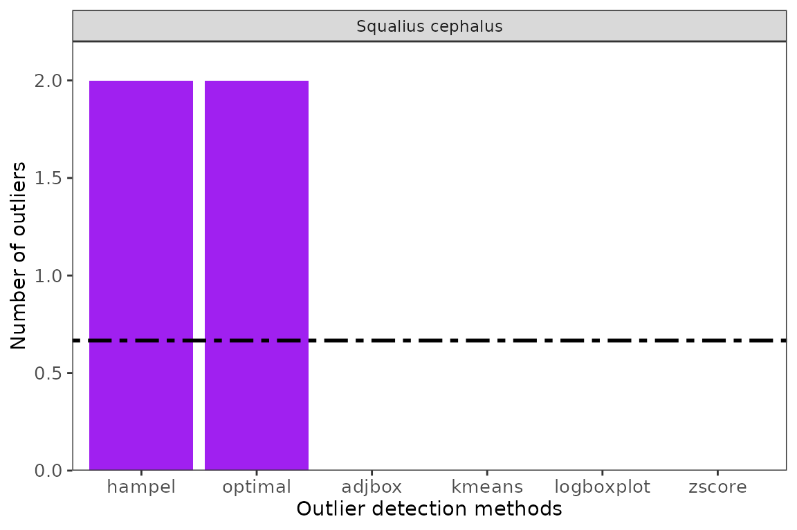

# Flag outliers based on species ecological ranges.

``` r
library(specleanr)
```

### Introduction to outlier detection based on species ecological ranges.

- Species ecological ranges provide the ecological limits within which
  the species can survive or reproduce within the ecosystem. These
  ranges are usually obtained from experimental setups or continued data
  collection. However, the species’ ecological ranges may vary due to
  colonization of new ranges. Therefore, if the species ecological
  ranges are available, then records obtained outside the ranges can be
  flagged as outliers that require further analysis.

- The sources of species ecological ranges include standard databases
  such as FishBase *(Froese and Pauly 2014)*, www.freshwaterecology.info
  *(Schmidt-Kloiber and Hering 2015)*, or the International Union for
  Conservation of Nature. Linking to these databases is not outside the
  scope of this package. Still, a user can collate a table of species’
  ecological ranges and use it in this package’s **`multidetect`**
  function to flag outliers.

- This method of using species ecological ranges is concertedly used
  with the other outlier detection methods, including univariate and
  multivariate methods, as shown below.

### Example using species ecological ranges with other outlier detection methods.

**1 Loading example datasets**

``` r
data("jdsdata")
data("efidata")

wcd <- terra::rast(system.file('extdata/worldclim.tiff', package = "specleanr"))

#match and clean

matchd <- match_datasets(datasets = list(jds= jdsdata, efi =efidata),
                         lats = 'lat', lons = 'lon',
                         country = 'JDS4_site_ID',
                         species = c('scientificName', 'speciesname'),
                         date=c('sampling_date','Date'))

#matchclean <- check_names(matchd, colsp = 'species', verbose = FALSE, merge = TRUE)

db <- sf::read_sf(system.file('extdata/danube.shp.zip',
                              package = "specleanr"), quiet = TRUE)
```

**2. Extracting environmental predictors from worldclim dataset**

``` r

refdata <- pred_extract(data = matchd, raster = wcd,
                        lat = 'decimalLatitude',
                        lon = 'decimalLongitude',
                        bbox = db,
                        colsp = 'species',
                        list = TRUE,
                        verbose = FALSE,
                        minpts = 6,
                        merge = FALSE)
```

**3. Preparing ecological ranges for Squalius cephalus**

**NOTE**

- The species ecological ranges are made for explanatory purposes, but
  do not reflect the species ecological ranges.
- `optdata` includes five columns, including **1) species**, which
  indicates the species names being studied. The names should be the
  same as those in the reference dataset. **2) mintemp** is the minimum
  temperature of the species (lower ecological limit). **3) maxtemp** is
  the species’ maximum temperature (upper ecological limit). **4)
  meantemp** is the species mean temperature, and **5) direction**,
  which signifies whether it is greater or lower than in the case of the
  mean temperature.

``` r

sqcep <- refdata["Squalius cephalus"]

optdata <- data.frame(species= c("Squalius cephalus", "Abramis brama"),
                      mintemp = c(6, 1.6),maxtemp = c(8.588, 21),
                      meantemp = c(8.5, 10.4), #ecoparam
                      direction = c('greater', 'greater'))
```

**4. Outlier detection with univariate, multivariate and species
ecological ranges**

- The `multiple` parameter is set to `TRUE` even when one species is
  considered because the data is extracted from `refdata` dataset that
  has multiple species.
- The `optpar` is provided in a list format and since the `mintemp` and
  `maxtemp` are provided, then the dirction of whether greater or lower
  are not required to be set.

``` r

squalius_outlier <- multidetect(data = sqcep, multiple = TRUE,
                      var = 'bio1',
                      output = 'outlier',
                      exclude = c('x','y'),
                      methods = c('zscore', 'adjbox', 'optimal', 'kmeans', "logboxplot", "hampel"),
                      optpar = list(optdf=optdata, optspcol = 'species',
                                    mincol = "mintemp", maxcol = "maxtemp"))
```

### Visualise the number of outliers detected by each method

``` r

ggoutliers(squalius_outlier)
```



### Obtaining quality controlled dataset using loess method or data labeling

``` r

squalius_qc_loess <- extract_clean_data(refdata = sqcep, 
                                      outliers = squalius_outlier, loess = TRUE)

#clean dataset
nrow(squalius_qc_loess)
#> [1] 19

#reference data
nrow(sqcep[[1]])
#> [1] 19

squalius_qc_labeled <- classify_data(refdata = sqcep, outliers = squalius_outlier)
```

### Visualise labelled quality controlled dataset

``` r


ggenvironmentalspace(squalius_qc_labeled, 
                     type = '1D',
                     ggxangle = 45, 
                     scalecolor = 'viridis',
                     xhjust = 1,
                     legend_position = 'blank',
                     ylab = "Number of records",
                     xlab = "Outlier labels")
```


### Summary explanation

- Outliers were flagged by species optimal ranges and the Hampel method;
  however, these were not flagged in other methods, which meant that
  these were not substantially absolute outliers. Consequently, based on
  outlier classification, only fair and not outlier ctageories were
  observed.

### References

1.  Schmidt-Kloiber, A., & Hering, D. (2015). www. freshwaterecology.
    info–an online tool that unifies, standardizes and codifies more
    than 20,000 European freshwater organisms and their ecological
    preferences. Ecological Indicators, 53, 271-282.
2.  Froese. R and Pauly D (2014). FishBase. world wide web electronic
    publication. fishbase. org.
