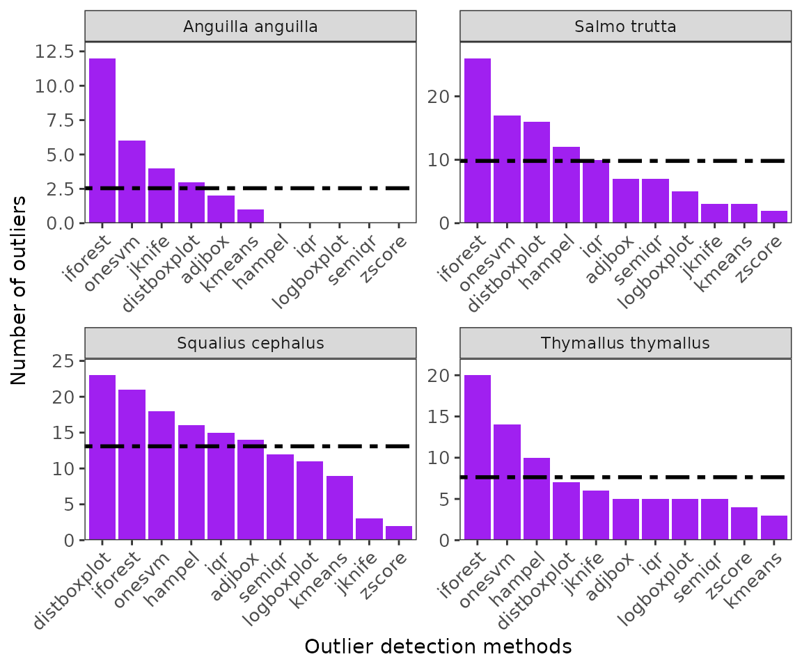
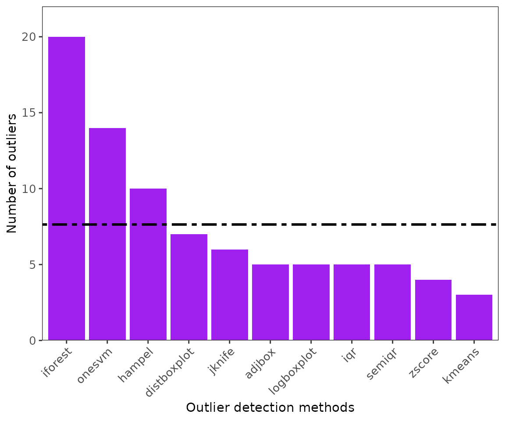
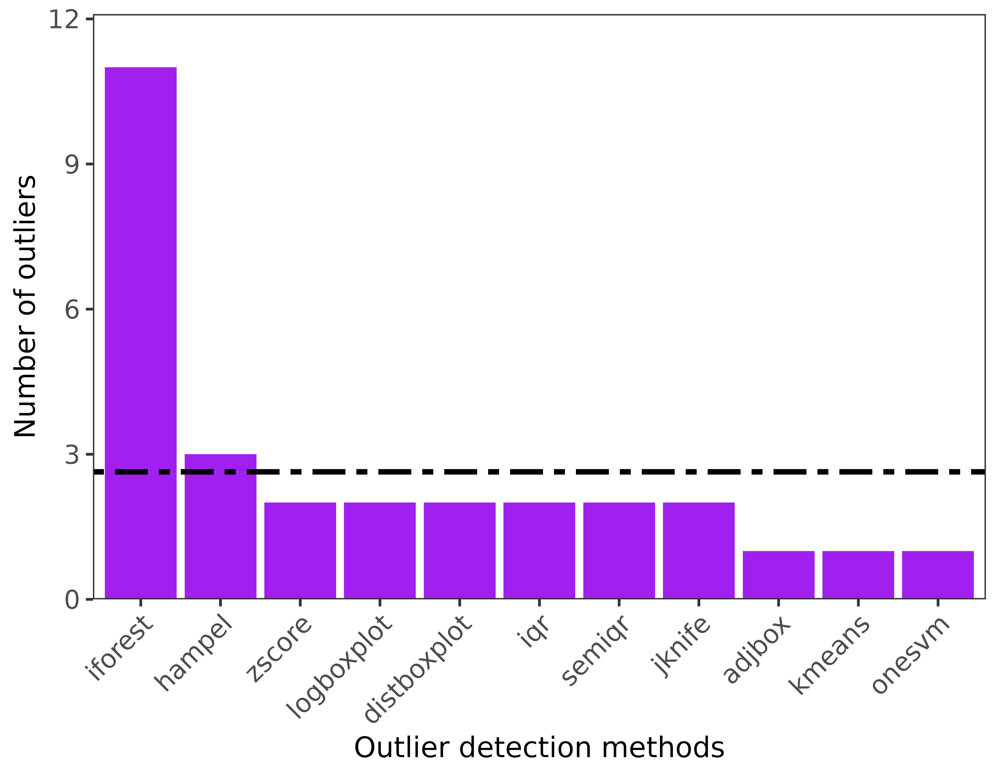
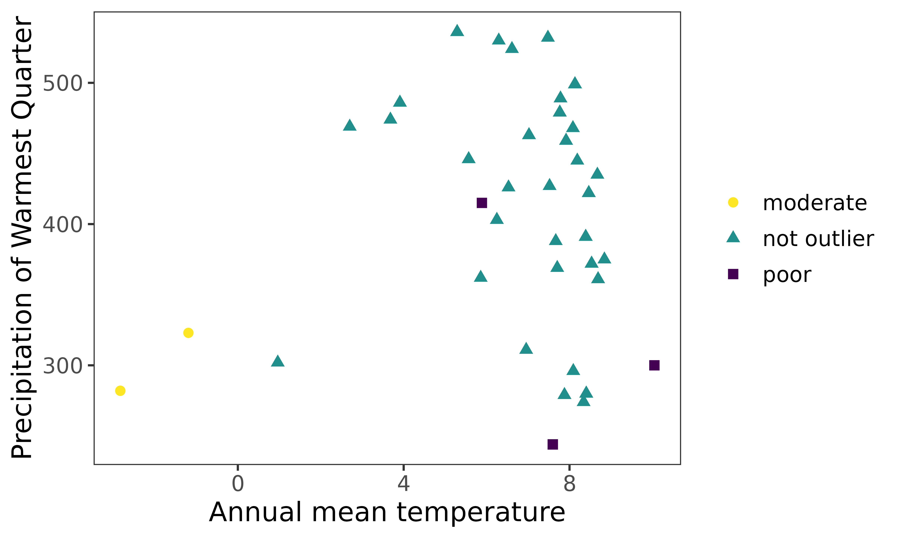
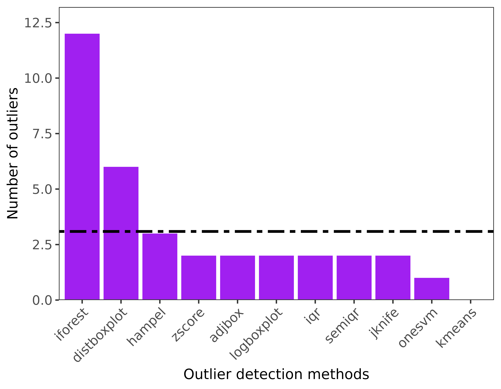
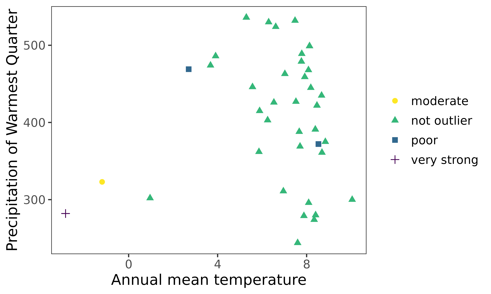

# Environmental outlier detection with bootstrapping and principal component analysis.

``` r

library(specleanr)
```

## Environmental outlier check for fish species from the Danube River Basin

The workflow for environmental outlier detection and removal is similar
across taxa, regions, or ecological realms. However, we included the
**[`check_names()`](https://anthonybasooma.github.io/specleanr/reference/check_names.md)**
function to cater for fish species names exhaustively. In this worked
example, we tried the functionalities on the fish species from the
Danube River Basin, with extracts of species records from Joint Danube
Survey (JDS) and EFI+ data archived in the package. We complimented the
data with fish species occurrences from online sources including Global
Biodiversity Information Facility (GBIF), iNaturalist, and VertNET using
the
**[`getdata()`](https://anthonybasooma.github.io/specleanr/reference/getdata.md)**
function. They are basically five steps, including: 1) Data acquisition
and harmonization; 2) Precleaning and predictor extraction 3) outlier
detection 4) identification of clean data and suitable method 5)
developing species distribution models (optional).

### Scope of application

In this workflow, we provide three approaches that can be used to handle
outlier detection, namely 1) the default approach (no bootstrapping and
principal component analysis applied); 2) bootstrapping applied during
outlier detection mostly for fewer records (user based to set the
records) and 3) combining principal component analysis and
bootstrapping. Because each approach will significantly affect how
records are flagged as outliers, its upon the user to select an approach
to use. However, we advise users to apply bootstrapping and PCA if the
particular suspicious records are still not handled in the first
approach.

### 1.Data acquisition: a) Collate species species records: offline and online data

The species records were obtained from the archived datasets extracted
from the Joint Danube Survey (<https://www.danubesurvey.org/jds4/>) and
EFIPLUS (Logez et al., 2012). To compliment species records, we used the
**[`getdata()`](https://anthonybasooma.github.io/specleanr/reference/getdata.md)**
function to retrieve data from the GBIF (<https://www.gbif.org/>),
VertNet (<http://www.vertnet.org/>) and iNaturalist (
<https://www.inaturalist.org/>) for *Squalius cephalus*, *Salmo trutta*,
*Thymallus thymallus*, and *Anguilla anguilla*. For online data, we
limited data to 50 records from each data source to reduce on the
execution time.

**NOTE**

This workflow may fail if the particular settings such as blocking of IP
address to GIBF, iNaturalist, FishBase, and VertNet may prevent user
from accessing the online data. Since, this may differ at user-to-user
basis, it is beyond the scope of this package to address such
limitations.

``` r
#==========================
#Step 1ai. Obtain Local data sources (archived in this package)
#=========================

data(efidata) #Data extract from EFIPLUS data

data(jdsdata) #Data extract from JDS4 data 

#===================================
#Step 1aii: Retrieve online data for the species: polygon to limit the extent to get records.
#=====================================
danube <- sf::st_read(system.file('extdata', "danube.shp.zip",
                                  package = 'specleanr'), quiet=TRUE)


df_online <- getdata(data = c("Squalius cephalus", 'Salmo trutta', 
                              "Thymallus thymallus","Anguilla anguilla"), 
                                extent = danube,
                                gbiflim = 50, 
                                inatlim = 50, 
                                vertlim = 50, 
                     verbose = FALSE)

dim(df_online)
#> [1] 400   8
```

#### Merging and harmonizing species records from different sources

The online data sources from
**[`getdata()`](https://anthonybasooma.github.io/specleanr/reference/getdata.md)**
and local files are merged using the
**[`match_datasets()`](https://anthonybasooma.github.io/specleanr/reference/match_datasets.md)**
function. Five columns are harmonized while combining data from
different sources: the country, species names, latitude/longitude
columns, and dates. The Darwin Core standard names are country, species,
decimalLatitude, decimalLongitude, and dates (Wieczorek et al., 2012).
So, if the local dataset has a different name for standard names, the
user should indicate it. For example, in JDS data, the species column is
labeled **speciesname**, shown in the species parameter for automatic
renaming and merging with other datasets. \* Note: The user should
indicate all dataset names in the list. \*
[`check_names()`](https://anthonybasooma.github.io/specleanr/reference/check_names.md)
is used to clean species names in terms of synonyms or spellings, based
on FishBase (<https://www.fishbase.se/>). This function generates
another column **speciescheck** that contain the clean names.

``` r

mergealldfs <- match_datasets(datasets = list(efi= efidata, jds = jdsdata, 
                                        onlinedata = df_online),
                country = c('JDS4_sampling_ID'),
                lats = 'lat', lons = 'lon',
                species = c('speciesname', 'scientificName'))

#Species names are re-cleaned since the species names from vertnet are changed.

cleannames_df <- check_names(data = mergealldfs, colsp = 'species', pct = 90, 
                             merge = TRUE, verbose = TRUE)
#> The synoynm Salmo trutta fario will be replaced with Salmo trutta.
#> The synoynm Salmo trutta lacustris will be replaced with Salmo trutta.
#> The synoynm Aspius aspius will be replaced with Leuciscus aspius.

#Filter out species from clean names df where the species names such as synonyms like Salmo trutta fario chnaged to Slamo trutta

speciesfiltered <- cleannames_df[cleannames_df$speciescheck %in%
                                   c("Squalius cephalus", 'Salmo trutta', 
                                     "Thymallus thymallus","Anguilla anguilla"),]
```

### 1. **Data acquisition: b) Environmental predictors from worldclim**

We used WORLDCLIM data archived in the package to enable users to test
the package functions seamlessly. For direct interaction with the
WORDCLIM data, please visit (<https://www.worldclim.org/>) and the
**`geodata`** package for download in user-customized workflows.
WORLDCLIM data has 19 bioclimatic variables
(<https://www.worldclim.org/data/bioclim.html>), including;

- `BIO1` = Annual Mean Temperature
- `BIO2` = Mean Diurnal Range (Mean of monthly (max temp - min temp))
- `BIO3` = Isothermality (BIO2/BIO7) (×100)
- `BIO4` = Temperature Seasonality (standard deviation ×100)
- `BIO5` = Max Temperature of Warmest Month
- `BIO6` = Min Temperature of Coldest Month
- `BIO7` = Temperature Annual Range (BIO5-BIO6)
- `BIO8` = Mean Temperature of Wettest Quarter
- `BIO9` = Mean Temperature of Driest Quarter
- `BIO10` = Mean Temperature of Warmest Quarter
- `BIO11` = Mean Temperature of Coldest Quarter
- `BIO12` = Annual Precipitation
- `BIO13` = Precipitation of Wettest Month
- `BIO14` = Precipitation of Driest Month
- `BIO15` = Precipitation Seasonality (Coefficient of Variation)
- `BIO16` = Precipitation of Wettest Quarter
- `BIO17` = Precipitation of Driest Quarter
- `BIO18` = Precipitation of Warmest Quarter
- `BIO19` = Precipitation of Coldest Quarter

``` r

#Get climatic variables from the package folder

worldclim <- terra::rast(system.file('extdata/worldclim.tiff', package = 'specleanr'))
```

### 2. Precleaning and environmental data extraction

Here,

- The duplicate records are removed if points they are obtained from the
  same location for the same species.

- The missing values coordinates are removed.

- The environmental predictors are extracted from the raster layers
  (WORLDCLIM).

- The user can set the minimum point for the species to be retianed for
  further analyis.

- The bounding box can be set to limit the extent of data extraction.
  For this case, we used the basin layer for the Danube Basin was
  obtained from Hydrography90m
  (<https://hydrography.org/hydrography90m/hydrography90m_layers>).

- The user can either return a dataframe or list of the cleaned data.
  Important in the next steps.

``` r

#Get basin shapefile to delineate the study region: optional

danube <- sf::st_read(system.file('extdata', 'danube.shp.zip', 
                                  package = 'specleanr'), quiet=TRUE)

#For multiple species indicate multiple TRUE
multipreclened <-  pred_extract(data= speciesfiltered, 
                             raster= worldclim, 
                             lat = 'decimalLatitude',
                             lon = 'decimalLongitude',
                             colsp = 'speciescheck',
                             bbox  = danube,  
                             list= TRUE, 
                             minpts = 10, merge = FALSE)
names(multipreclened)
#> [1] "Anguilla anguilla"   "Salmo trutta"        "Squalius cephalus"  
#> [4] "Thymallus thymallus"


thymallusdata <- speciesfiltered[speciesfiltered[,'speciescheck'] %in%c("Thymallus thymallus"),]

dim(thymallusdata)
#> [1] 130   7

thymallus_referencedata <-  pred_extract(data= thymallusdata, raster= worldclim, 
                             lat = 'decimalLatitude',
                             lon = 'decimalLongitude',
                             colsp = 'speciescheck',
                             bbox  = danube,
                             list= TRUE, 
                             minpts = 10)
dim(thymallus_referencedata)
#> [1] 83 21
```

### 3. Outlier detection for both single and multiple species (No PCA or bootstrapping)

Multiple outlier detection are set. This package contains 20 outlier
detection methods and the user can run
**[`extractMethods()`](https://anthonybasooma.github.io/specleanr/reference/extractMethods.md)**
to get the allowed methods. They are categorized into univariate,
multivariate and species ecological ranges. \* `var` is the predictor to
be used univariate methods. \* `exclude` allows to remove predictors
that user deems unnecessary. For example, the coordinates, since the
multivariate methods consider the whole dataset.

``` r

#For multiple species: default settings

multiple_spp_out_detection <- multidetect(data = multipreclened,
                      multiple = TRUE,
                      var = 'bio6',
                     exclude = c('x','y'),
                      methods = c('zscore', 'adjbox',
                                                'logboxplot', 'distboxplot',
                                                'iqr', 'semiqr',
                                                'hampel','kmeans',
                                                'jknife', 'onesvm',
                                                'iforest'))
#single species:default settings

thymallus_outlier_detection <- multidetect(data = thymallus_referencedata,
                      multiple = FALSE,
                      var = 'bio6',
                      output = 'outlier',
                      exclude = c('x','y'),
                      methods = c('zscore', 'adjbox',
                                  'logboxplot', 'distboxplot',
                                  'iqr', 'semiqr',
                                  'hampel','kmeans',
                                  'jknife', 'onesvm',
                                  'iforest'))
```

### 4. Outlier visualization for single and multiple species

- `ggoutliers` are based in ggplot2, so it can be modified based on user
  needs. x: is the output for outlier detection, y is the species name
  or index for multiple species, and raw = TRUE if the number of
  outliers are the displayed, otherwise the proportion of outliers to
  the total number of records will be plotted.

``` r
#for multiple species
ggoutliers(multiple_spp_out_detection)
```



``` r

#for single species
ggoutliers(thymallus_outlier_detection)
```



**Identify the best threshold using loess model.**

The local regression is used to optimize and identify the best threshold
for denoting the point as an absolute outlier. We fit the local region
model between the data retained at every threshold, and we identify a
maxima when the number of records retain are number of records retained
does not significantly vary with an increased increase in the threshold.

``` r

thymallus_opt_threshold <- optimal_threshold(refdata = thymallus_referencedata, 
                               outliers = thymallus_outlier_detection, plot = list(plot = TRUE, group = "Thymallus thymallus"))
```


``` r

#obtain the optimal thresholds for multiple species 

multspp_opt_threshold <- optimal_threshold(refdata = multipreclened, 
                                           outliers = multiple_spp_out_detection)
```

### 5. Extracting clean data from the reference data (precleaned data in step 2).

The user sets a threshold ranging from 0.1 to 1 but its advisable to set
a value above 0.5 to include above 50% of the methods. **threshold** is
the value indicating the proportion of methods to be used to classify a
record as a true outlier. For example, a threshold of 0.6 means that at
least in the 4 of the 6 methods noted during outlier detection in step
3. We used the loess method for identifying the optimal threshold.

``` r

multspecies_clean <- extract_clean_data(refdata = multipreclened, 
                                        outliers = multiple_spp_out_detection, 
                                        loess =  TRUE)
head(multspecies_clean)
#>        bio1     bio2     bio3     bio4     bio5     bio6     bio7     bio8
#> 1 10.042927 9.046562 30.40682 776.2538 26.19925 -3.55250 29.75175 19.52196
#> 2  8.340094 8.558521 31.95564 691.9463 23.15800 -3.62450 26.78250 15.38925
#> 3  7.765240 8.342354 31.78373 687.5156 21.74550 -4.50175 26.24725 16.19358
#> 4  8.390240 8.568895 31.32536 722.0088 23.12525 -4.22925 27.35450 17.21496
#> 5  9.624270 8.874875 30.36663 766.5389 25.47275 -3.75300 29.22575 18.99033
#> 6 10.705156 9.007730 30.22804 798.7291 26.63425 -3.16500 29.79925 18.81887
#>        bio9    bio10       bio11 bio12 bio13 bio14    bio15 bio16 bio17 bio18
#> 1 1.9554167 19.52196  0.38324997   644    80    35 28.87415   227   111   227
#> 2 1.1871250 16.93192 -0.08562502   789    97    44 28.08648   274   136   274
#> 3 0.6048333 16.19358 -0.60591668  1364   175    79 25.91408   479   270   479
#> 4 0.9156250 17.21496 -0.48479167  1142   143    68 23.92640   391   228   391
#> 5 1.6068749 18.99033  0.13245833   690    85    37 29.31466   245   117   245
#> 6 2.3845417 20.33225  0.70933336   536    60    28 23.59082   169    90   162
#>   bio19        x        y            groups
#> 1   115 16.91667 48.25000 Anguilla anguilla
#> 2   145 10.08333 48.41667 Anguilla anguilla
#> 3   274 13.58333 47.91667 Anguilla anguilla
#> 4   230 13.75000 48.08333 Anguilla anguilla
#> 5   126 17.25000 48.25000 Anguilla anguilla
#> 6   104 18.75000 47.41667 Anguilla anguilla

thymallus_qcdata <- extract_clean_data(refdata = thymallus_referencedata, 
                             outliers = thymallus_outlier_detection, 
                             loess = TRUE)


multiple_spp_qcdata <- classify_data(refdata = multipreclened, 
                                outliers = multiple_spp_out_detection, 
                                EIF = TRUE)
head(multiple_spp_qcdata)
#>       bio1     bio2     bio3     bio4     bio5     bio6     bio7     bio8
#> 2 8.340094 8.558521 31.95564 691.9463 23.15800 -3.62450 26.78250 15.38925
#> 3 7.765240 8.342354 31.78373 687.5156 21.74550 -4.50175 26.24725 16.19358
#> 4 8.390240 8.568895 31.32536 722.0088 23.12525 -4.22925 27.35450 17.21496
#> 5 9.624270 8.874875 30.36663 766.5389 25.47275 -3.75300 29.22575 18.99033
#> 7 7.765240 8.342354 31.78373 687.5156 21.74550 -4.50175 26.24725 16.19358
#> 8 7.765240 8.342354 31.78373 687.5156 21.74550 -4.50175 26.24725 16.19358
#>        bio9    bio10       bio11 bio12 bio13 bio14    bio15 bio16 bio17 bio18
#> 2 1.1871250 16.93192 -0.08562502   789    97    44 28.08648   274   136   274
#> 3 0.6048333 16.19358 -0.60591668  1364   175    79 25.91408   479   270   479
#> 4 0.9156250 17.21496 -0.48479167  1142   143    68 23.92640   391   228   391
#> 5 1.6068749 18.99033  0.13245833   690    85    37 29.31466   245   117   245
#> 7 0.6048333 16.19358 -0.60591668  1364   175    79 25.91408   479   270   479
#> 8 0.6048333 16.19358 -0.60591668  1364   175    79 25.91408   479   270   479
#>   bio19        x        y       label            groups         EIF
#> 2   145 10.08333 48.41667 not outlier Anguilla anguilla  0.57945232
#> 3   274 13.58333 47.91667 not outlier Anguilla anguilla -0.33957144
#> 4   230 13.75000 48.08333 not outlier Anguilla anguilla -0.05409521
#> 5   126 17.25000 48.25000 not outlier Anguilla anguilla  0.44483329
#> 7   274 13.58333 47.91667 not outlier Anguilla anguilla -0.33957144
#> 8   274 13.58333 47.91667 not outlier Anguilla anguilla -0.33957144


thymallus_qc_labelled <- classify_data(refdata = thymallus_referencedata, 
                              outliers = thymallus_outlier_detection, 
                              EIF = TRUE)
head(thymallus_qc_labelled)
#>       bio1      bio2     bio3     bio4     bio5     bio6     bio7     bio8
#> 1 8.464437  8.629666 32.26737 690.2155 22.73925 -4.00500 26.74425 16.96646
#> 2 7.668354 10.184875 32.43178 788.6816 24.10500 -7.29900 31.40400 17.19417
#> 3 8.390240  8.568895 31.32536 722.0088 23.12525 -4.22925 27.35450 17.21496
#> 4 8.091240  8.933604 32.88585 694.5287 22.77500 -4.39050 27.16550 16.61037
#> 5 7.765240  8.342354 31.78373 687.5156 21.74550 -4.50175 26.24725 16.19358
#> 6 7.765240  8.342354 31.78373 687.5156 21.74550 -4.50175 26.24725 16.19358
#>         bio9    bio10       bio11 bio12 bio13 bio14    bio15 bio16 bio17 bio18
#> 1  1.2360415 16.96646  0.07987499  1143   146    64 30.75084   422   207   422
#> 2 -2.2974584 17.19417 -2.29745841  1170   136    50 30.36596   388   173   388
#> 3  0.9156250 17.21496 -0.48479167  1142   143    68 23.92640   391   228   391
#> 4  0.8317083 16.61037 -0.43866670   808   106    42 32.08204   296   135   296
#> 5  0.6048333 16.19358 -0.60591668  1364   175    79 25.91408   479   270   479
#> 6  0.6048333 16.19358 -0.60591668  1364   175    79 25.91408   479   270   479
#>   bio19        x        y       label       EIF
#> 1   207 12.41667 47.91667 not outlier  1.619454
#> 2   173 14.25000 46.58333 not outlier -1.714716
#> 3   230 13.75000 48.08333 not outlier  1.392470
#> 4   138 11.75000 48.41667 not outlier  1.229253
#> 5   274 13.58333 47.91667 not outlier  1.116646
#> 6   274 13.58333 47.91667 not outlier  1.116646
```

### 6. Visualize labeled data in environmental space.

``` r

#multiple species 
ggenvironmentalspace(qcdata = multiple_spp_qcdata, 
                     xvar = 'bio1', 
                     yvar = "bio18", 
                     xlab = "Annual mean temperature",
                     ylab = "Precipitation of Warmest Quarter",
                     scalecolor = 'viridis',
                     ncol = 2, 
                     nrow = 2,
                     pointsize = 2)
```


``` r

#for single species
ggenvironmentalspace(qcdata = thymallus_qc_labelled,
                     xvar = 'bio1',
                     yvar = "bio18",
                     xlab = "Annual mean temperature",
                     ylab = "Precipitation of Warmest Quarter",
                     scalecolor = 'viridis',
                     pointsize = 2)
```


### Using bootstrapping during outlier detection

Bootstrapping is a robust approach where the records are randomly
sampled with replacement. In this approach, outlier detection is
iteratively conducted on bootstrap samples and each record flagged as
outlier is weighted based on the total number of bootstraps used. The
higher the record is flagged in several across multiple tests, the
higher the likelihood of record being an absolute outlier. Although the
default number of records at bootstrapping is 30, the maximum number of
records can be adjusted by the user as demonstrated below.

**Note**

Bootstrapping is not implemented by the defualt, so the user has to set
it run during outlier detection.

- The number of records **maxrecords** in reference dataset for
  *Thymallus thymallus* is 99. Therefore, to implement bootstrapping,
  indicate the maximum number of records higher than the nrows in
  reference dataset otherwise bootstrap will not be implemented.

- The number of bootstraps, **nb** are user-defined.

- Bootstrapping was conducted on *Thymallus thymallus* data because
  there was no proper separation between the moderate and very strong
  outliers.

``` r

thymallus_outlier_boot <- multidetect(data = thymallus_referencedata,
                      multiple = FALSE,
                      var = 'bio6',
                      exclude = c('x','y'),
                      methods = c('zscore', 'adjbox',
                                  'logboxplot', 'distboxplot',
                                  'iqr', 'semiqr',
                                  'hampel','kmeans',
                                  'jknife', 'onesvm',
                                  'iforest'),
                      bootSettings = list(run = TRUE, maxrecords = 100, nb = 10))
```

### Visulise outliers after bootstrapping

``` r

ggoutliers(thymallus_outlier_boot)
```



### Classify data to obtain labels

``` r

thymallus_qc_label_boot <- classify_data(refdata = thymallus_referencedata, 
                                outliers = thymallus_outlier_boot)
```

### Visualise after bootstrapping

``` r

ggenvironmentalspace(qcdata = thymallus_qc_label_boot, 
                     xvar = 'bio1', 
                     yvar = "bio18",
                     xlab = "Annual mean temperature",
                     ylab = "Precipitation of Warmest Quarter",
                     scalecolor = 'viridis',
                     pointsize = 2)
```



**Note**

When bootstrapping is applied, the very strong outlier turned into
moderate outlier.

### Apply principal component analysis and bootstrapping on *Thymallus thymallus* data.

- Principal component analyis is a dimension reduction approach vital
  for highly multidimensional datasets. The user can decide to apply
  either PCA and bootstrapping or only one of them.

- The number of principal components to be returned are changed using
  **npc** argument.

- The visualise the cummulation variance captured in the principal
  components, the argument **q** is used.

``` r

thymallus_outlier_boot_pca <- multidetect(data = thymallus_referencedata,
                      multiple = FALSE,
                      var = 'bio6',
                      exclude = c('x','y'),
                      methods = c('zscore', 'adjbox',
                                  'logboxplot', 'distboxplot',
                                  'iqr', 'semiqr',
                                  'hampel','kmeans',
                                  'jknife', 'onesvm',
                                  'iforest'),
                      bootSettings = list(run = TRUE, maxrecords = 100, nb = 10),
                      pc = list(exec = TRUE, npc = 6, q = FALSE))
#> The cummulative proprotion for PCs 6 is 0.99242
```

### Visulise outliers after bootstrapping and bootstrapping

``` r

ggoutliers(thymallus_outlier_boot_pca)
```



### Classify data to obtain labels

``` r

thymallus_qc_label_boot_pca <- classify_data(refdata = thymallus_referencedata, 
                                outliers = thymallus_outlier_boot_pca)
```

### Visualise after bootstrapping

``` r

ggenvironmentalspace(qcdata = thymallus_qc_label_boot_pca, 
                     xvar = 'bio1', 
                     yvar = "bio18",
                     xlab = "Annual mean temperature",
                     ylab = "Precipitation of Warmest Quarter",
                     scalecolor = 'viridis',
                     pointsize = 2)
```



**Notes**

Coupling PCA and bootstrapping are robust approaches to handle outlier
detection. In this example, moderate outlier turned into poor outliers.

**References**

1.  Wieczorek, J., Bloom, D., Guralnick, R., Blum, S., Döring, M.,
    Giovanni, R., Robertson, T., & Vieglais, D. (2012). Darwin core: An
    evolving community-developed biodiversity data standard. PLoS ONE,
    7(1). <https://doi.org/10.1371/journal.pone.0029715>
