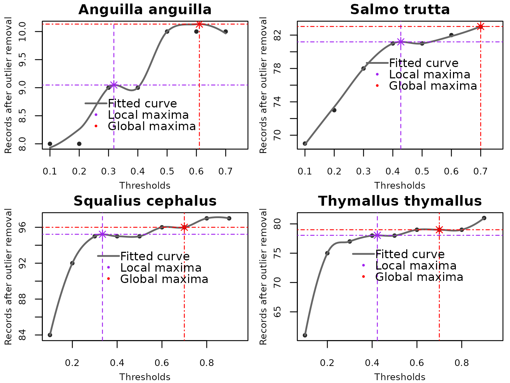

# Optimising the LOESS method used for automatic identification of the outlier thresholds.

``` r
library(specleanr)
```

## Identifying the optimal threshold for identifying absolute outliers using the local regression method (LOESS).

In the *speclceanr* package, besides using the naive methods and data
classification, we incorporated the local regression method (LOESS) in
setting the optimal threshold to identify the absolute outliers. LOESS
is a non-parametric scatterplot smoothing method that uses point-wise
linear regression to smooth scatter plots *(Cleveland 1979; Cleveland
and Devlin 1988)*. Because it is a non-parametric method, the
relationship between the independent and dependent variables should not
be set beforehand (Jacoby 2000). It can reveal complex data patterns
compared to traditional statistical methods *(Jacoby 2000)*.

LOESS is less computationally intensive for small datasets, easy to
compute, and highly resistant to outliers *(Cleveland 1979)*. Therefore,
we use it to predict the optimal threshold after modeling the
relationship between the data points retained at each threshold. The
thresholds for outlier detection range from 0 to 1 (0 means not an
outlier or the record has not been flagged in any of the outlier
detection methods used, and 1 represents a perfect outlier where the
record has been flagged in all the methods). Therefore, at each
threshold, the data points are retained or flagged out. Then, at the
optimal threshold (global or local maximum), the data points retained
are asymptotic, meaning no more records are flagged out. The optimal
threshold is then used to retain the quality-controlled dataset used in
further analysis.

**NOTE**

- If errors in the workflow is associated with FishBase, rerun after 2
  to 5 minutes.

## Examples using fish species

### Data processing: species and environmental variables

``` r

data(efidata) 

data(jdsdata) 

danube <- sf::st_read(system.file('extdata', "danube.shp.zip",
                                  package = 'specleanr'), quiet=TRUE)


df_online <- getdata(data = c("Squalius cephalus", 'Salmo trutta',"Thymallus thymallus"),
                     extent = danube,
                     gbiflim = 50,
                     inatlim = 50,
                     vertlim = 50,
                     verbose = FALSE)


mergealldfs <- match_datasets(datasets = list(efi= efidata, jds = jdsdata,
                                              onlinedata = df_online),
                              country = c('JDS4_sampling_ID'),
                              lats = 'lat', lons = 'lon',
                              species = c('speciesname', 'scientificName'))
#Cleaning data

cleannames_df <- check_names(data = mergealldfs, colsp = 'species', pct = 90,
                             merge = TRUE, verbose = FALSE)

spfilter <- cleannames_df[cleannames_df$speciescheck %in%
                                   c("Squalius cephalus", 'Salmo trutta',
                                     "Thymallus thymallus","Anguilla anguilla", 
                                     'Barbatula barbatula'),]

worldclim <- terra::rast(system.file('extdata/worldclim.tiff', package = 'specleanr'))

#Get basin shapefile to delineate the study region: optional

danube <- sf::st_read(system.file('extdata', 'danube.shp.zip',
                                  package = 'specleanr'), quiet=TRUE)
```

### Oultier detection, threshold optimisation using LOESS and plotting

``` r
parm <- par(mfrow = c(2, 2),
    mar = c(3,3, 1.5, 0.5),
    oma = c(0, 0, 0, 0),
    mgp = c(1.7, 0.8, 0)
)

spp <- unique(spfilter$speciescheck)

pltout <- lapply(spp, function(s){
  
  spout <- spfilter[spfilter[,'speciescheck'] %in%s,]
  
  refdata <-  pred_extract(data= spout, raster= worldclim,
                           lat = 'decimalLatitude',
                           lon = 'decimalLongitude',
                           colsp = 'speciescheck',
                           bbox  = danube,
                           list= TRUE,
                           minpts = 10)
  
  outdet <- multidetect(data = refdata, multiple = FALSE,
                        var = 'bio6', output = 'outlier',
                        exclude = c('x','y'),
                        methods = c('zscore', 'adjbox',
                                    'logboxplot', 'distboxplot',
                                    'iqr', 'semiqr','seqfences',
                                    'hampel','kmeans',
                                    'jknife', 'onesvm',
                                    'iforest'), 
                        warn = FALSE)
  print(nrow(refdata))
  
  opt <- optimal_threshold(refdata = refdata, outliers = outdet, 
                             plotsetting = list(plot = TRUE, group = s))
  opt
  
})
#> [1] 11
#> [1] 15
#> [1] 84
#> [1] 98
#> [1] 82
```



``` r
par(parm)
```

### Summary explanation

To ensure the **LOESS** model was only fitted if a group or species had
absolute outliers, we set a cutoff of **0.6**. So, LOESS will not be
fitted if outliers are not detected in less than half of the outlier
detection methods. For example, in the figure above, the threshold was
only optimized for *Salmo trutta*, *Anguilla anguilla*, and *Thymallus
thymallus*. In *Barbatula barbatula* and *Squalius cephalus* the
outliers with the highest weight was 0.41 and 0.5 respectively.

### Simulating for small datasets less than 25 records

``` r
set.seed(113554333)
a <- rnorm(30, 32, 1)
b <- rnorm(30, 4, 1)
c <- rnorm(30, 0, 1)
d <- rnorm(30, 6, 1)
#add outlier rows
out <- c(409, 43, 76, 23)
out1 <- c(-0.2409, 10, 43, 22)
out2 <- c(1509, 0.43, 76, 23)

df <- data.frame(a, b, c, d)

df2 <- rbind(df, out, out1, out2)
```

**Outlier detection for small datasets**

``` r
outdet2 <- multidetect(data = df2, multiple = FALSE,
                      var = 'a', output = 'outlier',
                      methods = c('zscore', 'adjbox',
                                  'logboxplot', 'distboxplot',
                                  'iqr', 'semiqr','seqfences',
                                  'hampel','kmeans',
                                  'jknife', 'onesvm',
                                  'iforest'), 
                      warn = FALSE)
```

**Visualize the threshold**

``` r
par(mar = c(3, 3, 1.5, 1.5))

opt1 <- optimal_threshold(refdata = df2, 
                          outliers = outdet2, 
                         plotsetting = list(plot = TRUE))
```


``` r
opt1
#>  localmaxima globalmaxima 
#>    0.3333333    0.7000000
```

- In the above scenario, the outlier detection exponentially increased
  and therefore absolute outliers were recorded denoted when the
  predictions exponentially increased. The optimal threshold of 0.7 will
  be automatically determined which filters out the three absolute
  outliers introduced in the data.

**Record weights used quality controlled data extraction.**

``` r
#get the weights for the flagged records

weights <- ocindex(x = outdet2, absolute = TRUE, props = TRUE, threshold = 0.1, warn = FALSE)

print(weights)
#>   absoluteoutliers absolute_propn
#> 1       1509.00000      0.8333333
#> 2         -0.24090      0.8333333
#> 3         29.67535      0.2500000
#> 4         29.93587      0.1666667
#> 5         30.21504      0.1666667
#> 6        409.00000      0.8333333

dfclean <- extract_clean_data(refdata = df2, outliers = outdet2, loess = TRUE)

print(dfclean)
#>           a        b           c        d
#> 1  31.25813 3.737545 -0.82219326 7.503630
#> 2  31.02957 2.119252  0.13058514 6.440053
#> 3  33.29139 5.233229  1.18249791 6.088826
#> 4  31.96807 2.922396  0.82110108 5.327947
#> 5  32.61594 2.546680 -0.83512143 5.219957
#> 6  29.67535 4.710109  0.55900929 5.895726
#> 7  31.76902 3.506267 -0.46201898 6.381637
#> 8  31.45304 3.843909 -1.65670047 6.140398
#> 9  32.04668 2.965477  0.64843924 6.047407
#> 10 32.73326 4.184567 -1.00567760 5.731261
#> 11 33.21300 5.091759  0.38357100 4.818790
#> 12 30.21504 3.176954 -1.17762603 5.049447
#> 13 33.21133 4.047397 -1.35670434 5.635227
#> 14 32.66286 4.972343  1.44484341 5.595836
#> 15 31.96946 4.216062  0.53427151 6.666718
#> 16 31.05610 3.842254 -0.01738607 5.205542
#> 17 31.71313 3.653900 -0.66187088 6.121317
#> 18 29.93587 4.788469 -0.45837542 6.988470
#> 19 31.05060 4.961393 -1.43076151 5.958698
#> 20 32.97297 3.277845 -0.85659474 6.011441
#> 21 33.29464 3.245113  2.54273477 7.643912
#> 22 31.49925 4.432043  0.01498154 5.916007
#> 23 34.18672 4.237679 -2.22131128 7.192626
#> 24 31.64430 5.113328  1.21073632 5.014243
#> 25 32.01278 5.279782 -0.80406361 6.343229
#> 26 31.44525 5.176739  0.41815878 5.454909
#> 27 31.50548 3.282632 -0.65628423 6.113609
#> 28 32.48145 2.885475  0.39630888 5.864295
#> 29 31.09465 3.842594  1.03801580 6.327794
#> 30 31.75320 3.720425  1.08670241 4.024865
```

**NOTE**

- The outliers are removed from the dataset from the dataset
  automatically using the LOESS method.
- The legend is sometimes hidden.

### References

1.  Cleveland, W. S. 1979. Robust Locally Weighted Regression and
    Smoothing Scatterplots. - J Am Stat Assoc 74
2.  Cleveland, W. S. and Devlin, S. J. 1988. Locally Weighted
    Regression: An Approach to Regression Analysis by Local Fitting. - J
    Am Stat Assoc 83
3.  Jacoby, W. G. 2000. Electoral inquiry section Loess: a
    nonparametric, graphical tool for depicting relationships between
    variables. - Elect Stud 19
